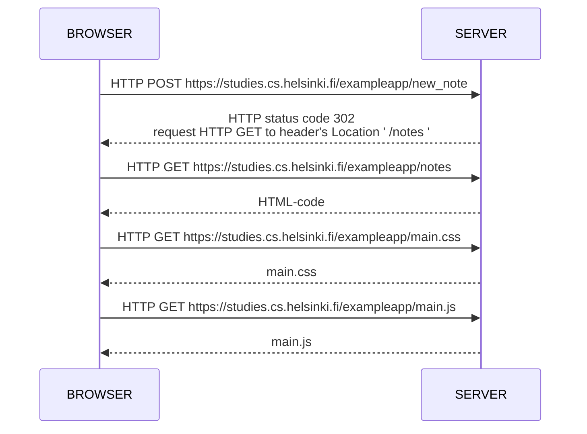

```mermaid
sequenceDiagram

    BROWSER->>SERVER: HTTP POST https://studies.cs.helsinki.fi/exampleapp/new_note
    SERVER-->>BROWSER: HTTP status code 302 <br> request HTTP GET to header's Location ' /notes '
    BROWSER->>SERVER: HTTP GET https://studies.cs.helsinki.fi/exampleapp/notes
    SERVER-->>BROWSER: HTML-code
    BROWSER->>SERVER: HTTP GET https://studies.cs.helsinki.fi/exampleapp/main.css
    SERVER-->>BROWSER: main.css
    BROWSER->>SERVER: HTTP GET https://studies.cs.helsinki.fi/exampleapp/main.js
    SERVER-->>BROWSER: main.js

```
