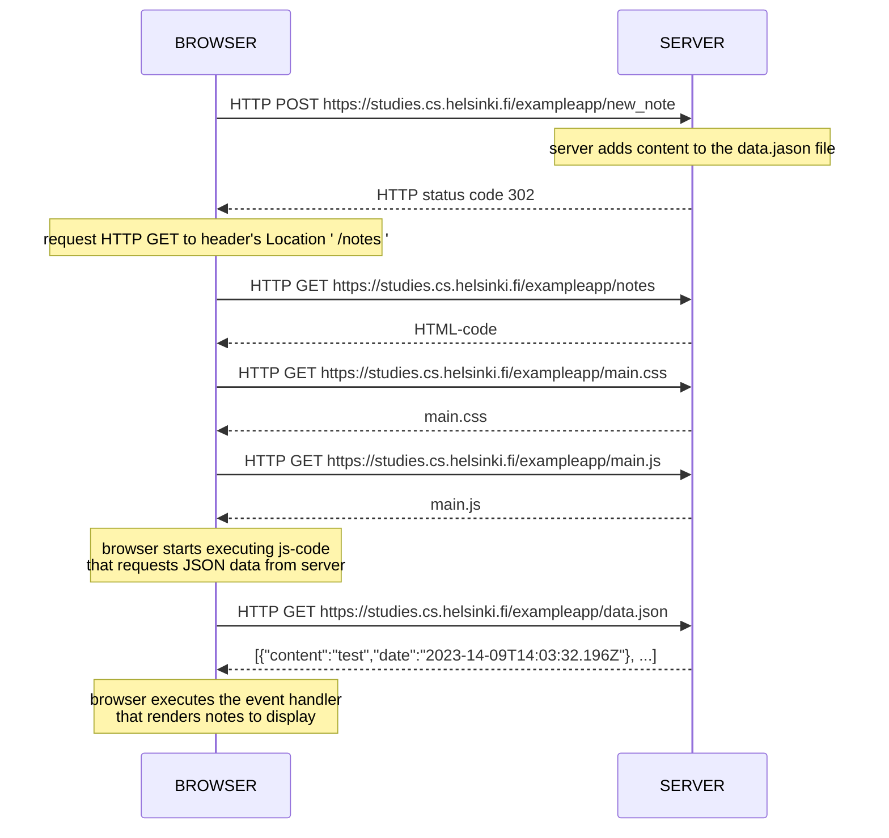

```mermaid
sequenceDiagram

    BROWSER->>SERVER: HTTP POST https://studies.cs.helsinki.fi/exampleapp/new_note
    Note over SERVER: server adds content to the data.jason file
    SERVER-->>BROWSER: HTTP status code 302
    Note over BROWSER: request HTTP GET to header's Location ' /notes '
    BROWSER->>SERVER: HTTP GET https://studies.cs.helsinki.fi/exampleapp/notes
    SERVER-->>BROWSER: HTML-code
    BROWSER->>SERVER: HTTP GET https://studies.cs.helsinki.fi/exampleapp/main.css
    SERVER-->>BROWSER: main.css
    BROWSER->>SERVER: HTTP GET https://studies.cs.helsinki.fi/exampleapp/main.js
    SERVER-->>BROWSER: main.js

    Note over BROWSER: browser starts executing js-code <br> that requests JSON data from server 

    BROWSER->>SERVER: HTTP GET https://studies.cs.helsinki.fi/exampleapp/data.json
    SERVER-->>BROWSER: [{"content":"test","date":"2023-14-09T14:03:32.196Z"}, ...]

    note over BROWSER: browser executes the event handler <br> that renders notes to display


```
